# Overview

-----

# Table of Contents

- [Preparation](#preparation)
  - [Bill of Materials (BOM)](#bom)
    - [Off-the-Shelf Parts](#purchase)
    - [3D Printing](#3d-printing)
- [Actuators](#actuators)
  - [Actuator Assembly ⨉4](#assemble-actuators)
  - [Wiring](#wiring)
    - [Power Supply](#power-supply)
    - [Encoder Connection](#encoder-connection)
    - [Motor Connection](#Motor-connection)
  - [Actuator Calibration](#actuator-calibration)
    - [Calibrate ODrives](#calibrate-odrives)
    - [Calibrate Zero Position](#calibrate-zero-position)
- [Gripper](#Gripper)
  - [Finger Assembly ⨉2](#finger)
  - [Gripper Assembly](#gripper-assembly)
  - [Mounting](#mounting-ur10)
  - [Validation](#validation)
- [Customization](#customization)
  - [Mounting](#custom-mounting)
  - [Geometry](#geometry)
  - [Fingertip](#fingertip)
- [Getting Started](#getting-started)
  
-----

# Hardeware
<a name="bom"></a>
## Bill of materials(BOM)
<a name="purchase"></a>
### Off-the-shelf parts
- [T-motor gb54-2](https://store.tmotor.com/goods-445-GB54-2.html) X 4
- [Odrive s1](https://odriverobotics.com/shop/odrive-s1) X 4
- [AS5048A Encoder + solid magnet](https://ko.aliexpress.com/item/1005004239532357.html?spm=a2g0o.ppclist.product.16.189a33gr33grC1&pdp_npi=2%40dis%21KRW%21%E2%82%A9%2020%2C299%21%E2%82%A9%2020%2C299%21%21%21%21%21%402103011616813606980156478ed18f%2112000028490990365%21btf&_t=pvid%3A1729ba70-2e9e-4e62-ae44-2781def9d2bc&afTraceInfo=1005004239532357__pc__pcBridgePPC__xxxxxx__1681360698&gatewayAdapt=glo2kor) X 4
- [Bearing - outer-diameter = 100mm, inner-diamter = 6mm](https://kr.misumi-ec.com/vona2/detail/221000058378/?KWSearch=%eb%b2%a0%ec%96%b4%eb%a7%81&searchFlow=results2products) X 12
- [Dowel pin - diameter = 6mm, length = 10mm](https://ko.aliexpress.com/item/1005003326358562.html?spm=a2g0o.productlist.main.9.5f9d4520HPGHnd&algo_pvid=eee7164e-1d0b-425a-bb77-c06aaa2ae10c&aem_p4p_detail=202304140514266025200904223640004224758&algo_exp_id=eee7164e-1d0b-425a-bb77-c06aaa2ae10c-4&pdp_npi=3%40dis%21KRW%2113356.0%217080.0%21%21%21%21%21%40211bd8be16814744666117620d07da%2112000025228771502%21sea%21KR%210&curPageLogUid=YaY5cKEIVcXy&ad_pvid=202304140514266025200904223640004224758_5&ad_pvid=202304140514266025200904223640004224758_5) X 6
- [Wire terminal box](https://mini.freeship.co.kr/goods/content.asp?guid=14063350&freeship_ep=naver_ep&NaPm=ct%3Dlpapaqwg%7Cci%3Df02b7700f5a0e323cb475c55121ebd49967d7324%7Ctr%3Dsls%7Csn%3D405974%7Chk%3Da901253e6a96e25815c6a2b1212b2f65c958629d) X 1
- Shielded cable
- 3-phase cable


### 3D Printing
- [Adapter plate](stl/adapter_plate.stl/) X 4
- [Bearing spacer](stl/bearing_spacer.STL) X 12
- [Calibration arm](stl/calibration_arm.STL) X 1
- [Calibration stand](stl/calibration_stand.STL) X 1
- [Coupler](stl/coupler.STL) X 1
- [Couping](stl/coupling.stl) X 1
- [Distal link](stl/distal_link.STL) X 2
- [Distal tip link](stl/distal_tip_link.STL) X 2
- [Finger tip](stl/finger_tip.STL) X 2
- [Gripper shell](stl/gripper_shell.stl) X 1
- [Magnet holder](stl/magnet_holder.STL) X 4
- [Motor plate](stl/motor_plate.stl) X 4
- [Proximal link](stl/proximal_link.STL) X 4
<br/><br/>The gripper is designed to be compatible with Rainbow robotics RB5. For other robot systems, it should be better to design your own adapter plate and coupling.

# Actuators
## Acutator assembly


## Wiring
The components should be connected following the diagram below. The encoder connection(black) and power connection(green) will be further elaborated.
 

### Power Supply
First connect the DC power supply to the wall plug. Then connect it to the four ODrive boards, positive to positive, negetaive to negative. There is no on/off button on the boards, plug in the wall plug to turn the system on, unplug to turn it off.


### Encoder Connection
For the encoder connection, we fabricate a cable assembly as shown below in the schematic. It is recommended to verify the connectivity and resistance of each connection to make sure the cables are soldered properly. We also recommend to label each connector like the schematic.


After successful fabrication, connect the motor encoders and the ODrives.

### Motor Connection
Keep the 3-phase connection consistent as shown below.


### Odirve S1 Pin map.


# Actuator Calibration

Each actuator module require calibration before use. This step __can not__ be done after the gripper is assembled, so do not postpone this step.

We explicitly define the `direction of the rotor` to be the direction the hexagonal logo on the rotor is pointing at, and the `zero position of the motor` to be when the direction of the motor is pointing at the opposite direction of the power port on the stator. 

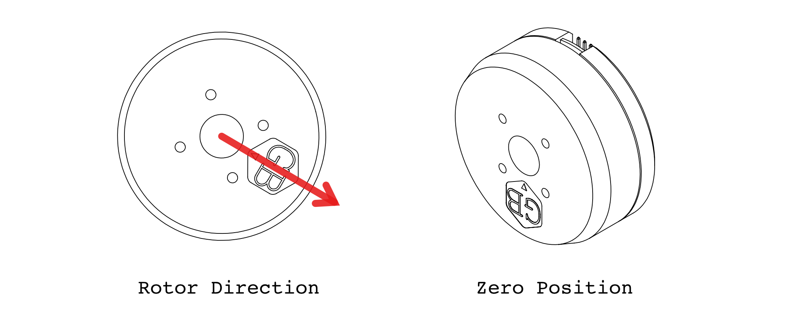


## Calibrate ODrives


## Calibrate Zero Position

Here we calibrate the zero position of the motor. Mount the actuator on the calibration stand and install the calibration arm onto the actuator according to the diagram

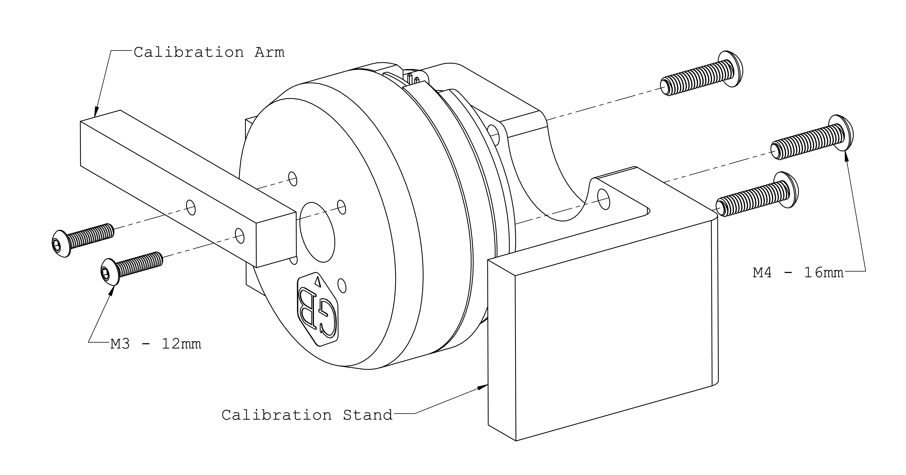


Put the motor into zero position as show in the diagram below. Press down the calibration arm to make sure the stand and arm touch tightly. 

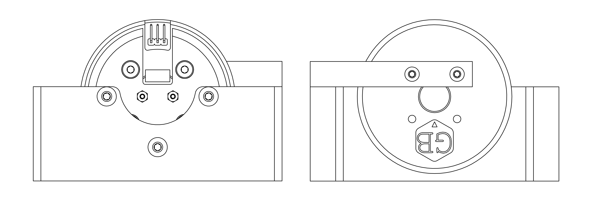


It should be zero when motor is in [zero position](#zero-position-of-the-motor). Also try 90° and 180°. Don't mind the sign at this stage of assembly.


# Gripper

<a name="finger"></a>

## Finger Assembly ⨉ 2

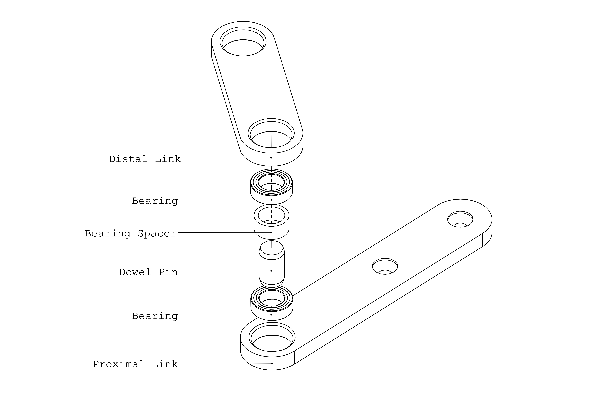

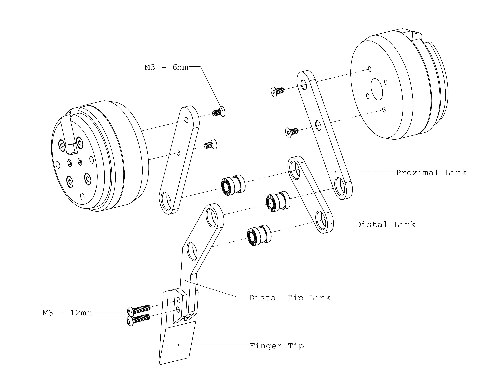


## Gripper Assembly

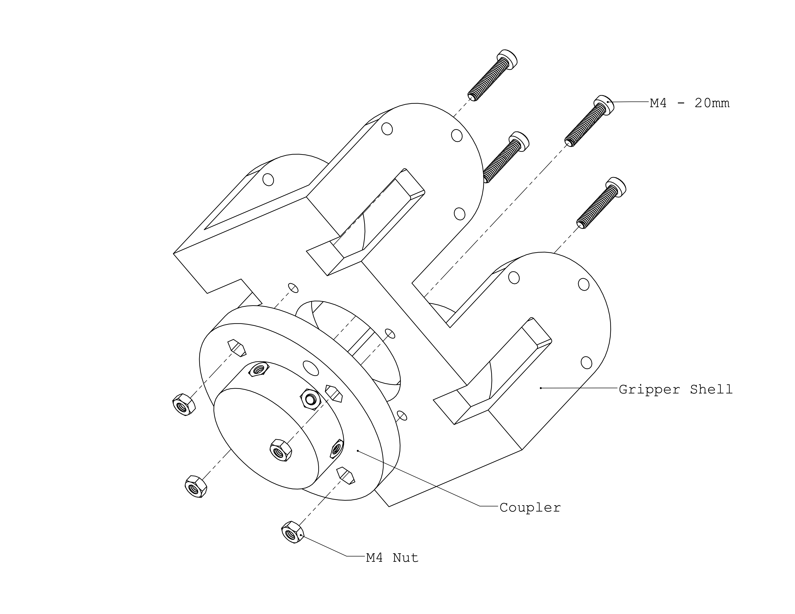

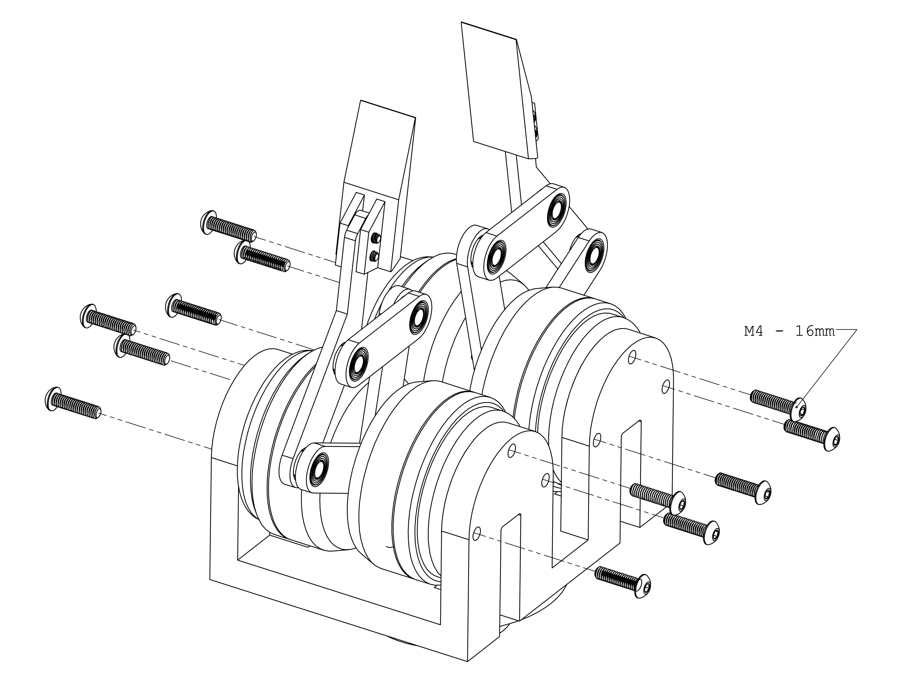

<a name="mounting-ur10"></a>

## Mounting

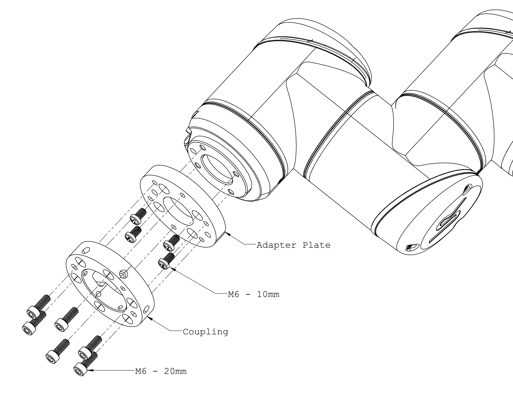

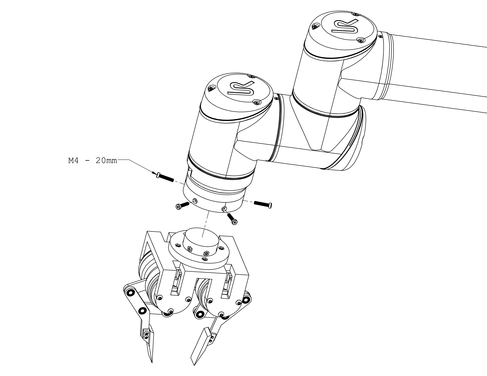


## Validation


# Customization


## Mounting

If the default mounting does not work for you, it's very easy to make a custom mount. The gripper has a __60 mm PCD with 4 ⨉ M4__ mounting interface, as shown in the drawing below.

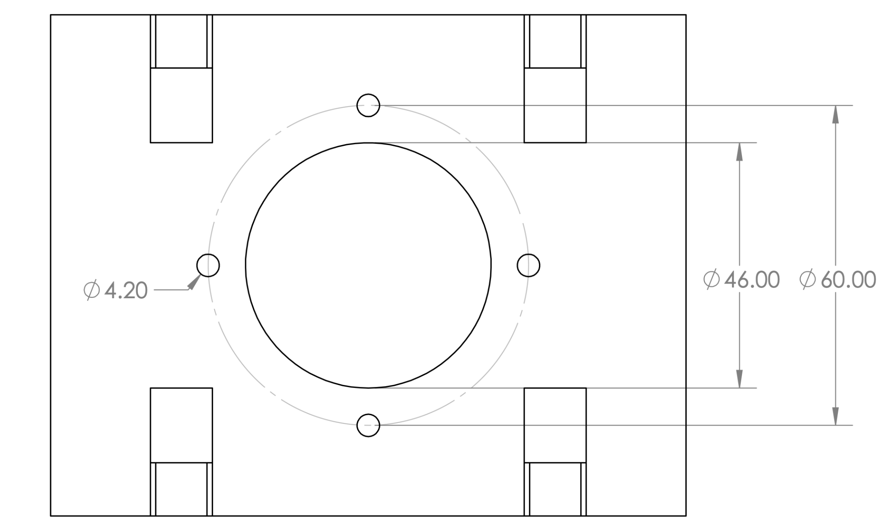

## Geometry

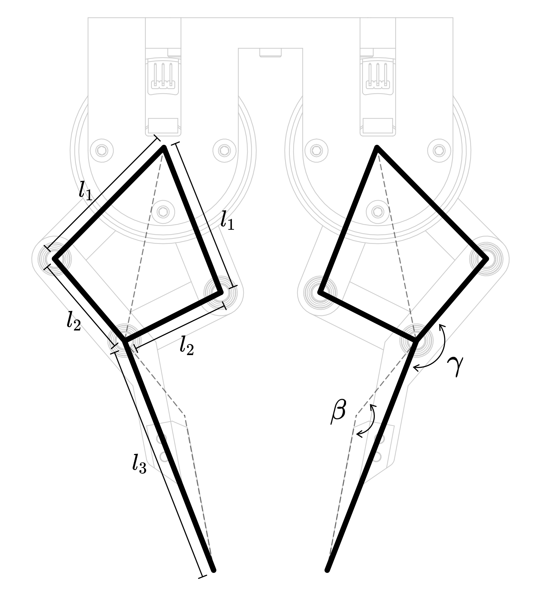

The geometrical parameters can be customized. After you design your custom parts, update the `ddh_driver/config/default.yaml` so the driver can work properly. 

| Parameter | Configuration Path | Unit |
|----|------|-----|
| ℓ₁ | `/geometry/l1` | mm |
| ℓ₂ | `/geometry/l2` | mm |
| ℓ₃ | `/geometry/l3` | mm |
| 𝝱 | `/geometry/beta` | degree |
| 𝛄 | `/geometry/gamma` | degree |

## Fingertip


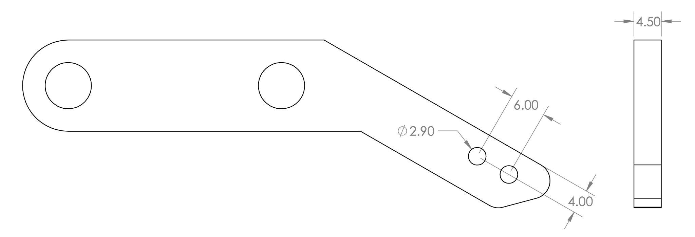


-----
# Software
Our software is implemented with **python3** and tested on **Ubuntu**. You can also refer to this website https://docs.odriverobotics.com/v/latest/guides/getting-started.html.

### Versions ###
- ubuntu : 20.04
- Python : 3.10.11
- Odrive control untility : 0.6.7

### Getting started ###
1. First, you should install accompanying PC program for the ODrive, 'odrivetool'.
```bash
pip install --upgrade odrive
```
2. Set up USB device permissions.
```bash
sudo bash -c "curl https://cdn.odriverobotics.com/files/odrive-udev-rules.rules > /etc/udev/rules.d/91-odrive.rules && udevadm control --reload-rules && udevadm trigger"
```
3. To launch the main interactive ODrive tool, type 'odrivetool'. And then, type 'odrv0.vbus_voltage' to inspect the boards main supply voltage.
```bash
odrivetool
```
&nbsp;&nbsp;&nbsp;&nbsp;If the program is installed and the odrive is connected successfully, then you can see the messages.
```bash
ODrive control utility v0.6.7
Please connect your ODrive
You can also type help() or quit().

Connected to ODrive S1 384D34783539 (firmware v0.6.7) as odrv0
In  [1]: odrv0.vbus_voltage
Out [1]: 23.931137084960938
```
-----

# Contributors
- Hyeonje Cha, guswp3611@gmail.com
- Seunghwa Oh, seunghwa9118@pusan.ac.kr
